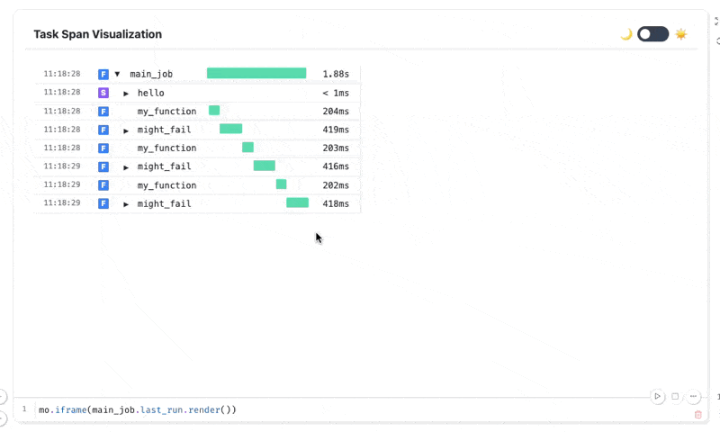

### flowshow

> Just a super thin wrapper for Python tasks that form a flow.

## Installation

```bash
uv pip install flowshow
```

## Usage

Flowshow provides a `@task` decorator that helps you track and visualize the execution of your Python functions. There is also a context manager called `span` that can do the same as well as some logging utilities like `info`, `warning` and `add_artifacts`. In short, here's how to use it:

```python
import time
import random
from pydantic import BaseModel
from typing import List
from flowshow import task, add_artifacts, info, debug, warning, error, span

class Foobar(BaseModel):
    x: int
    y: int
    saying: str

class ManyBar(BaseModel):
    desc: str
    stuff: List[Foobar]

@task
def many_things(many: ManyBar):
    info("This runs for demo purposes")

@task
def my_function(x):
    info("This function should always run")
    time.sleep(0.2)
    add_artifacts(foo=1, bar=2, buz={"hello": "there"})
    return x * 2

@task(retry_on=ValueError, retry_attempts=5)
def might_fail():
    info("This function call might fail")
    time.sleep(0.2)
    my_function(2)
    # raise ValueError("oh noes")
    debug("The function has passed! Yay!")
    return "done"

@task()
def main_job():
    info("This output will be captured by the task")
    add_artifacts(manybar=ManyBar(desc="hello", stuff=[Foobar(x=1, y=2, saying="ohyes")]))
    with span("hello") as s:
        info("test test")
        with span("foobar") as f:
            info("whoa whoa")

    for i in range(3):
        my_function(10)
        might_fail()
    return "done"

# Run like you might run a normal function
_ = main_job()
```

Once you run your function you can expect some nice visuals, like this one:

```python
main_job.last_run.render()
```



You can fully inspect the flow of the program, which can help you debug or refactor your code. It plays very nice with interactive notebooks too!
